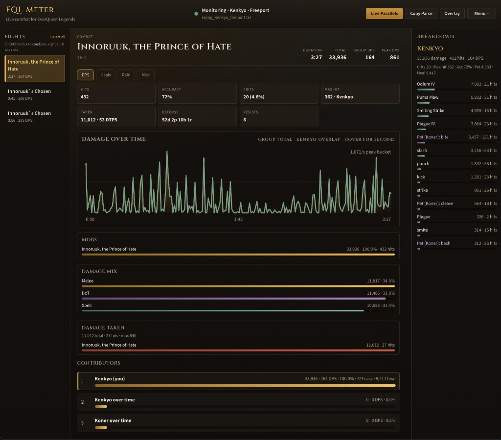

# EQL Meter

Live combat meter for **EverQuest Legends** — tails your character log, tracks fights in real time, and shows DPS in a main window plus a click-through overlay.



[Latest release](https://github.com/kpxcoolx/eql-meter/releases/latest) · [Discussions](https://github.com/kpxcoolx/eql-meter/discussions) · [Changelog](CHANGELOG.md) · [MIT License](LICENSE.md)

---

## Start here

| I am… | Do this |
|-------|---------|
| Playing on **Windows** | Install the `.exe` → [Windows guide](docs/windows.md) |
| On **Mac + osxEQL** | Install the `.dmg` → [Mac guide](docs/mac.md) |
| On **Mac + Parallels** | Same `.dmg`, attach to the VM log → [Parallels guide](docs/mac-parallels.md) |

> **Players:** download the installer. You do not need Node, Rust, or Git.  
> Releases ship a **Windows** `.exe` and a **macOS** `.dmg`.

### Mac Gatekeeper

The Mac app is not notarized by Apple yet. After dragging **EQL Meter** to Applications, the first open may say it’s damaged or can’t be opened. Clear quarantine once in Terminal, then open normally:

```bash
xattr -dr com.apple.quarantine "/Applications/EQL Meter.app"
```

Full steps: [Mac guide](docs/mac.md).

---

## What you get

| | |
|--|--|
| **Live fights** | Multi-mob Combined view, ability breakdown, DPS chart |
| **Overlay** | Always-on-top meter; click-through so the game stays playable |
| **Raid / heals / loot** | `/who all raid` roster, healing done + received, loot from the log |
| **Convenience** | Remembers last log + window positions; optional ability-name file |

---

## Everyday controls

| Control | Use it for |
|---------|------------|
| **Find / Auto-detect log** | Attach to your character log |
| **Copy Parse** | Copy a compact parse (confirmation popup) |
| **Overlay** | Open / close floating meter (confirmation popup with position) |
| **Menu** | Choose log, stop, click-through, check for updates |

Tabs in the main meter: **DPS** · **Heals** · **Raid** · **Loot**

### Overlay hotkeys

| Shortcut | Action |
|----------|--------|
| `Ctrl/Cmd+Shift+U` | Overlay clickable |
| `Ctrl/Cmd+Shift+L` | Click-through to game |

Run EQ **windowed** or **borderless** so the overlay can sit on top.

---

## Contributors

Feature ideas and questions: use [Discussions](https://github.com/kpxcoolx/eql-meter/discussions) (Ideas / Q&A). Bugs: open an [Issue](https://github.com/kpxcoolx/eql-meter/issues).

```bash
npm install
npm run tauri:dev
```

| Platform | Notes |
|----------|--------|
| macOS | [Mac + osxEQL](docs/mac.md) · [Mac + Parallels](docs/mac-parallels.md) |
| Windows | [Windows guide](docs/windows.md) · find the Legends log |

### Ship an installer

Do not ask players to build. Do **not** create a GitHub Release by hand before CI finishes — empty releases break **Check for updates**.

1. Bump `package.json` / `tauri.conf.json` / `Cargo.toml`
2. Commit, then tag and push:

```bash
git tag v0.1.14 && git push origin v0.1.14
```

CI builds a **draft** with the Windows NSIS `.exe`, macOS `.dmg`, and updater assets, then **publishes only if those assets exist**. Until then, `/releases/latest` still points at the previous good build.

Or: **Actions → release → Run workflow** with the tag. Requires `TAURI_SIGNING_PRIVATE_KEY` (and optional password).

Local builds:

```bash
# Windows (on Windows)
npm run tauri:build:windows   # → src-tauri/target/release/bundle/nsis/

# macOS (Apple Silicon)
npm run tauri:build:mac       # → src-tauri/target/release/bundle/dmg/
```

Parser fixtures for offline tests: [`samples/`](samples/).
